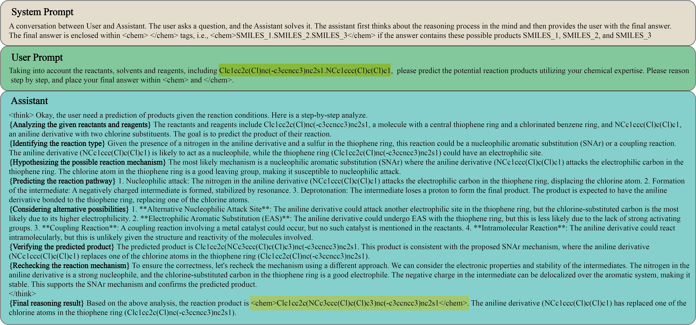

# Towards Knowledge‑and‑Data‑Driven Organic Reaction Prediction: RAG‑Enhanced and Reasoning‑Powered Hybrid System with LLMs

  🔬 ICLR 2026 | 🧪 LLM for Chemistry | ⚡ RAG + Reasoning

---

## 📌 Highlights

- 🧠 **Hybrid LLM System**: Combines Retrieval-Augmented Generation (RAG) and Chain-of-Thought (CoT) reasoning  
- 🔍 **Knowledge Injection**: Similar reaction retrieval improves factual grounding  
- 🔗 **Step-by-Step Reasoning**: Explicit reaction mechanism inference  
- 🧩 **RL Optimization**: Further enhances reasoning performance with GRPO training
- 🏆 **SOTA Performance**: Exact Match and Molecular Fingerprint Similarity on Open Reaction Dataset (ORD)

---

## 📖 Abstract

In organic reaction prediction, many recent approaches ranging from traditional task-specific models to Large Language Models (LLMs), have demonstrated notable success. However, these methods are inherently data-driven, exhibit constrained interpretability, and have hit fundamental performance bottlenecks. To overcome these limitations, we present Reaction-Thinker, a hybrid, knowledge-and-data-driven system that is enhanced by Retrieval-Augmented Generation (RAG) and powered by advanced reasoning, improving both the interpretability of prediction process and the explainability of results. We develop a similar-case retrieval database and train a RAG-based LLM through supervised fine-tuning (SFT) to apply both reaction types and similar reaction cases as knowledge. We also construct a reaction reasoning chain-of-thought (CoT) dataset and train a reasoning-based LLM through SFT, then further optimize it using Group Relative Policy Optimization (GRPO). Experimental results show that our method outperforms all compared LLMs and task-specific models, achieving the highest accuracy (Exact Match) and fingerprint similarity (FTS). Ablation study indicates improvements in relative accuracy of 7.5% and 13.9% for RAG and GRPO, respectively. Further analysis of mispredictions reveals limitations in conventional evaluation metrics, which motivates our proposed benchmarking refinement.

---

## 🏗️ System Architecture

  

  <em>Figure 1: Overview of the Reaction-Thinker framework. The system architecture, training process, and inference pipeline.</em>

The figure illustrates the overall pipeline of the proposed system, including the reaction type classifier, similar-case retrieval module, RAG-based predictor, and reasoning-based predictor. The system dynamically routes inputs based on the availability of similar reaction cases.

---

### 🔧 Components

1. **Reaction Type Classifier**
   - Input: SMILES
   - Output: Reaction type + Molecular embedding

2. **Retrieval Module**
   - L2 distance over molecular embeddings
   - Builds reaction-type-specific retrieval database

3. **RAG-based Predictor**
   - Injects retrieved reaction cases into user prompt

4. **Reasoning-based Predictor**
   - CoT-based deduction when no similar cases exist

---

## 📊 Chain-of-Thought Data Construction

  

  <em>Figure 2: An example of CoT dataset for reasoning, including system prompt, user prompt, and supervised output.</em>

The dataset will be released on HuggingFace soon.

---

#### Stage 1: Initial CoT Generation

- **`CoT-Gen.py`**: Script for generating reasoning-based samples given reaction SMILES.
- **`User_Prompt.txt`**: Contains the prompt template used to query LLMs for CoT generation and reasoning-based prediction.

- Source:
  - USPTO-MIT dataset  
- Method:
  - Prompt Qwen2.5-72B-Instruct to generate reasoning-based reconstructions of reaction mechanism
- Post-processing:
  - Format normalization + Keyword-based filtering
- Result:
  - ~119K CoT samples  

#### Stage 2: Distillation & Validation

- Source:
  - ORD dataset
- Method:
  - Fine-tune DeepSeek-R1-Distill-Qwen-7B on Stage 1 data
  - Retain samples during GRPO training via reward-based selection
- Result:
  - ~575K high-quality CoT samples  
  - ~55K unique reactions  

---

## ⚙️ Environment Dependencies

### Core Environment

| Package | Version |
|--------|--------|
| python | 3.10.16 |
| ms-swift | 3.12.2 |
| torch | 2.8.0 |
| transformers | 4.57.6 |
| vllm | 0.11.0 |
| rdkit | 2025.3.2 |

---

## 🏋️ Training

### 1. Reaction Type Classifier
- **`Classifier.py`**: Training script for the reaction type classifier. It takes SMILES strings as input, predicts the reaction type, and generates molecular embeddings used for similarity retrieval.

### 2. RAG-based LLM Training
- **`RAG-Qwen-32B.sh`**: Shell script for training the **RAG-based LLM** (based on Qwen3-32B) using **Supervised Fine-Tuning (SFT)**. This model injects retrieved similar reaction cases as knowledge into the prompt.

### 3. Reasoning-based LLM Training
- **`SFT-DeepSeek-32B-1.sh`**, **`SFT-DeepSeek-32B-2.sh`**: Scripts for multi-node **Supervised Fine-Tuning** of the **Reasoning-based LLM** (based on DeepSeek-R1-Distill-Qwen-32B).
- **`GRPO-DeepSeek-32B-1.sh`**, **`GRPO-DeepSeek-32B-2.sh`**: Scripts for multi-node **Group Relative Policy Optimization (GRPO)** of the **Reasoning-based LLM**.

